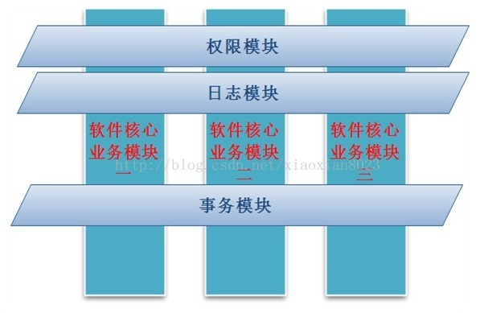
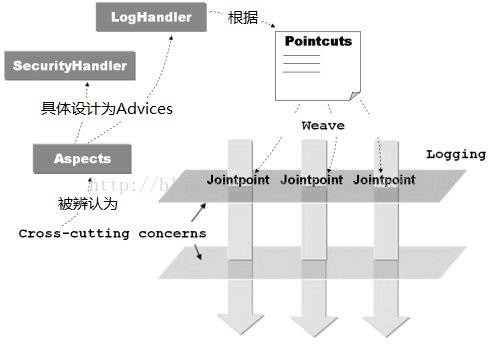
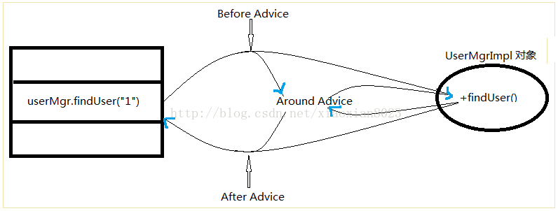

#AOP

   AOP(Aspect Oriented Programming)，是面向切面编程的技术。AOP基于IoC基础，是对OOP的有益补充
   AOP之所以能得到广泛认可，主要是因为它将应用系统拆分分了2个部分：核心业务逻辑（Core business concerns）及横向的通用逻辑，也就是所谓的切面Crosscutting enterprise concerns。例如，所有大中型应用都要涉及到的持久化管理（Persistent）、事务管理（Transaction Management）、权限管理（Privilege Management）、日志管理（Logging）和调试管理（Debugging）等。使用AOP技术，可以让开发人员只专注核心业务，而通用逻辑则使用AOP技术进行横向切入，
   由专人去处理这些通用逻辑，会使得任务简单明了，提高开发和调试的效率。
   
   
## 基本概念
   ### 要想了解AOP，首先得了解几个重要的基本概念：

 * 切面（Aspect）：一个关注点的模块化，这个关注点实现可能另外横切多个对象。比如说事务管理就是J2EE应用中一个很好的横切关注点例子。切面用Spring的Advisor或拦截器实现。
 * 连接点（Joinpoint）：程序执行过程中明确的点，如方法的调用或特定的异常被抛出。
 * 通知（Advice）：在特定的连接点，AOP框架执行的动作。各种类型的通知包括“around”、“before”和“throws”通知。通知类型将在下面讨论。许多AOP框架包括Spring都是以拦截器做通知模型，维护一个“围绕”连接点的拦截器链。
 * 切入点（Pointcut）：指定一个通知将被引发的一系列连接点的集合。AOP框架必须允许开发者指定切入点，例如，使用正则表达式。
 * 目标对象（Target Object）：包含连接点的对象，也被称作被通知或被代理对象。
 * AOP代理（AOP Proxy）：AOP框架创建的对象，包含通知。在Spring中，AOP代理可以是JDK动态代理或CGLIB代理。
 * 编织（Weaving）：组装方面来创建一个被通知对象。这可以在编译时完成（例如使用AspectJ编译器），也可以在运行时完成。Spring和其他纯Java AOP框架一样，在运行时完成织入。
 
 
 ## 各种通知（Advice）类型 
  ### 为了符合各种流程处理，通知类型提供了5种，可以对目标方法进行全方位处理：
  * Before advice：在某连接点（JoinPoint）之前执行的通知，但这个通知不能阻止连接点前的执行。
  * ApplicationContext中在<aop:aspect>里面使用<aop:before>元素进行声明。
  * After advice：当某连接点退出的时候执行的通知（不论是正常返回还是异常退出）。
  * ApplicationContext中在<aop:aspect>里面使用<aop:after>元素进行声明。
  * After returnadvice：在某连接点正常完成后执行的通知，不包括抛出异常的情况。
  * ApplicationContext中在<aop:aspect>里面使用<aop:after-returning>元素进行声明。
  * Around advice：包围一个连接点的通知，类似Web中Servlet规范中的Filter的doFilter方法。可以在方法的调用前后完成自定义的行为，也可以选择不执行。
  * ApplicationContext中在<aop:aspect>里面使用<aop:around>元素进行声明。
  * Afterthrowing advice：在方法抛出异常退出时执行的通知。
  * ApplicationContext中在<aop:aspect>里面使用<aop:after-throwing>元素进行声明
   
   
  
  ## AOP 2种代理的区别
   ### AOP支持2种代理，Jdk的动态代理和CGLIB实现机制。二者有什么区别呢：
   * Jdk基于接口实现：JDK动态代理对实现了接口的类进行代理。
   * CGLIB基于继承：CGLIB代理可以对类代理，主要对指定的类生成一个子类，因为是继承，所以目标类最好不要使用final声明。 
       通常情况下，鼓励使用jdk代理，因为业务一般都会抽象出一个接口，而且不用引入新的东西。如果是遗留的系统，以前没有实现接口，那么只能使用CGLIB
 
